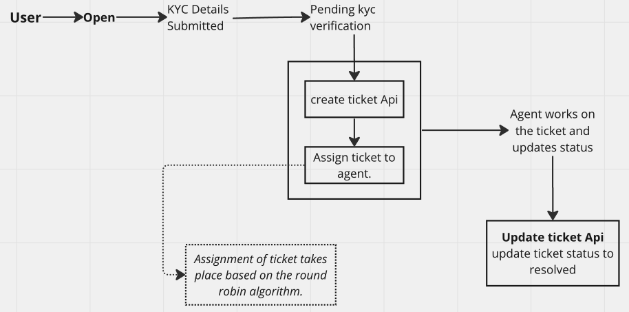

# Ticketing Service Technical Specification 
# Introduction 
This service will be responsible for creating and assigning any tickets to the specific agents
# Existing System
Currently we do not have any system in place for creating and managing tickets.
When a user is onboarded and completes his KYC, the status of the user become *Pending-KYC-Verification*. The admin then queries the users currently in that status and displays them in a KYC-tray. The KYC team then downloads the users in this tray into an excel. Then they assign each user from that excel to a specific agent manually. Each agent has to check in the excel for the tickets assigned to him, then search for the user in the KYC-tray and perform the verification.
A similar workflow is followed in case of RISK-verification.
## System Design 
*There is no existing system design*
### API design 
*There are no existing APIs*
### DB Schema
*There are no existing DB schemas*

# Proposed System
We are going to build a ticketing service which will reduce the manual labour like dowloading excels and assigning agents. We will provide APIs for managing agents,tickets and teams whcih need to be integrated by both backend and admin for smooth resolution of tickets.
## Assumptions
*All the assumptions we consider while designing the system. Add what all we consider are out of the scope also in this section.*
## Requirements 
*Product and technical requirements*
### Product Requirements 
1. *Product should be able to get/create/update tickets and assign them to respective agents.*
1. *Product should have capabality of fetching/creating/updating teams and assigning agents to each team.One agent can belong to multiple teams.*
1. *Should be capable of marking agent as not available.*
1. *Should be able to reassign pending tickets*
1. *Deleting agents/groups should be available.*
1. *Any changes should be reflected in an audit log table*
### Technical and Non-Functional Requirements
*To be discussed*
## System Design
*To be discussed*
#
## DB Schema
*Ticket table:*

### ***Table:* tickets**

| NAME                        | TYPE          | CONSTRAINTS            |
| --------------------------- | ------------- | ---------------------- |
| id                          | UUID          | NOT NULL               |
| type/groupId                | UUID          | NOT NULL               |
| status                      | BOOL          | NOT NULL               |
| userId                      | INT           | NOT NULL (Foreign Key) |
| agentId                     | VARCHAR       |                        |
| priority                    | INT           | NOT NULL               |
| createdAt                   | timestamp     | NOT NULL               |
| updatedAt                   | timestamp     | NOT NULL               |

*Agents Table:*

### ***Table:* agents*

| NAME                          | TYPE      | CONSTRAINTS |
| ---------------               | -------   | ----------- |
| agentId                       | VARCHAR   | NOT NULL    |
| ticketGroup                   | INT       |             |
| activeStatus                  | BOOL      | NOT NULL    |
| totalTicketsAssigned          | INT       | NOT NULL    |
| totalTicketsResolved          | INT       | NOT NULL    |
| ticketsAssignedToday          | INT       | NOT NULL    |
| ticketsResolvedToday          | INT       | NOT NULL    |

*Ticket types/groups table*

### ***Table:* ticket_groups**

| NAME                  | TYPE      | CONSTRAINTS           |
| --------------------- | --------- | --------------------- |
| groupId               | UUID      | NOT NULL              |
| name                  | VARCHAR   | NOT NULL              |
| activeStatus          | BOOL      | NOT NULL              |

*Ticketing service audit log table* - **Need discusion on the data needed to be stored.**

### ***Table:* ticketing_service_audit_log**

| NAME                  | TYPE              | CONSTRAINTS           |
| --------------------- | ---------         | --------------------- |
| id                    | UUID              | NOT NULL              |
| ticketID              | VARCHAR           | NOT NULL              |
| userID                | INT               | NOT NULL              |
| ticketDetails         | JsonStructure     | NOT NULL              |
#
### APIs and Functionality
#### *Ticket Related APIs.*
1. Create Ticket - used for creating the tickets
2. Update Ticket - used for updating the following - status, agentId, priority
3. Get Tickets by filters - Get by agentId, Get by groupId, etc.
4. Bulk Update Tickets - for reasigning tickets in case an unavailabe agent ha multiple pending tickets.
#### *Group and Agent related APIs.*
1. Create group - used for creating a group/team e.g KYC,Risk,Mymoney etc.
2. Delete Group - in case the group is no longer needed.
3. Create Agent - used for creating the agent.
4. Update agent - used for updating the agent satus, ticket group of the agent.
5. Delete agent - in case the agent is no longer present in our system.
#                              
## Design 

### Ticket Assignment
- Ticket assignment takes place based on Round-Robin Algorithm.
- First we will fetch list of all available/active agents pertaining to the particular ticket group.
- We will fetch the agent based on the least *ticketsAssignedToday* and assign the ticket to that agent. This will ensure an equal distribution of tickets across all agents.
### Ticket Reassignment 
- This case arises when one or more agents are inactive but have unresolved tickets assigned to them.
- In this case the tickets assigned to them need to redistributed across the other active agents.
- We fetch the list of tickets for assigned to the inactive agents.
- We also fetch the list of active agents and sort the in order of total tickets assigned that day.
- Then we equally reassign the tickets to each available agent in that order.

## Security
*To be discussed* 
## Monitoring 
### Product Metrics 
*All the product level metrics we have to monitor on this service*
### Tech Metrics 
*All the technical level metrics we have to monitor on this service*
## Proof Of Concept
*If this specification initiative is a platform initiative which can be used for multiple different use cases, explain how will we use this component in multiple use cases* 
## Migration 
*To be discussed*
## Database migration
*To be discussed*
## Rollback Plan
*To be discussed*

## Ramp up Plan
*To be discussed*

# Open Questions 
*To be discussed*

